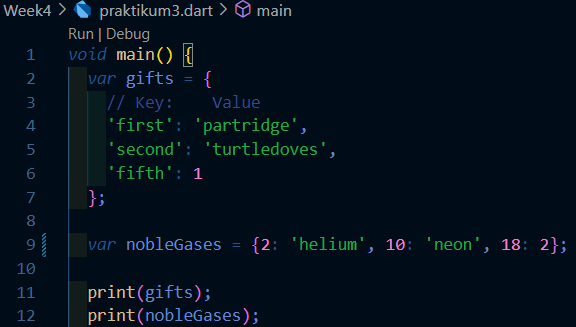
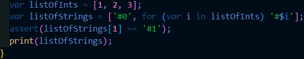

# Laporan Praktikum Week 4

NIM : 2241720227 \
NAMA : MUHAMMAD IRSYAD DANY \
KELAS : TI - 3G

# PRAKTIKUM 1 :

## Eksperimen Tipe Data List

### Langkah 1 dan 2:

Ketik atau salin kode program berikut ke dalam fungsi main() dan Silakan coba eksekusi (Run) kode pada langkah 1 tersebut.

Apa yang terjadi? Jelaskan!

### Jawaban

Tidak ada error yang akan terjadi karena semua assert valid dan program akan berjalan sesuai yang diharapkan.

Berikut adalah penjelasan tentang apa yang terjadi ketika kode dieksekusi, langkah demi langkah:

> var list = [1, 2, 3];: Kode ini membuat sebuah list berisi tiga angka: [1, 2, 3].

> assert(list.length == 3);: Kode ini menggunakan fungsi assert untuk memeriksa apakah panjang list adalah 3. Jika benar, eksekusi program dilanjutkan. Jika salah, program akan berhenti dengan error.

> assert(list[1] == 2);: Kode ini memeriksa apakah elemen pada indeks 1 dari list adalah 2.

> print(list.length);: Ini akan mencetak panjang list, yaitu 3.

> print(list[1]);: Ini akan mencetak nilai elemen pada indeks 1, yang adalah 2.

> list[1] = 1;: Ini mengubah nilai elemen pada indeks 1 dari 2 menjadi 1.

> assert(list[1] == 1);: Memeriksa apakah elemen pada indeks 1 sekarang adalah 1 setelah perubahan.

> print(list[1]);: Ini akan mencetak nilai elemen pada indeks 1 setelah diubah menjadi 1.

---

### Langkah 3:

Ubah kode pada langkah 1 menjadi variabel final yang mempunyai index = 5 dengan default value = null. Isilah nama dan NIM Anda pada elemen index ke-1 dan ke-2. Lalu print dan capture hasilnya.

Apa yang terjadi ? Jika terjadi error, silakan perbaiki.

- Output
  

---

# PRAKTIKUM 2 :

## Eksperimen Tipe Data Set

### Langkah 1 dan 2:

Ketik atau salin kode program berikut ke dalam fungsi main() dan Silakan coba eksekusi (Run) kode pada langkah 1 tersebut.

Apa yang terjadi? Jelaskan! Lalu perbaiki jika terjadi error.

### Jawaban

Kode diatas merupakan inisialisasi pada variabel halogens yang berisi 5 nama lalu variabel tersebut di print semua isinya

---

### Langkah 3:

Tambahkan kode program berikut, lalu coba eksekusi (Run) kode Anda.

Apa yang terjadi ? Jika terjadi error, silakan perbaiki namun tetap menggunakan ketiga variabel tersebut. Tambahkan elemen nama dan NIM Anda pada kedua variabel Set tersebut dengan dua fungsi berbeda yaitu .add() dan .addAll(). Untuk variabel Map dihapus, nanti kita coba di praktikum selanjutnya.

Dokumentasikan code dan hasil di console, lalu buat laporannya.

### Jawaban

- Output

---

# PRAKTIKUM 3 :

## Eksperimen Tipe Data Maps

### Langkah 1 dan 2:

Ketik atau salin kode program berikut ke dalam fungsi main() dan Silakan coba eksekusi (Run) kode pada langkah 1 tersebut.

Apa yang terjadi? Jelaskan! Lalu perbaiki jika terjadi error.

### Jawaban

Kode tersebut membuat dua variabel, yaitu gifts dan nobleGases. Pada variabel gifts, kunci bertipe data string, dan nilainya dapat berupa string atau angka. Sedangkan pada nobleGases, kunci berupa angka, dan nilainya bisa berupa string atau angka. Keduanya kemudian dicetak seluruh isinya menggunakan print().

---

### Langkah 3:

Tambahkan kode program berikut, lalu coba eksekusi (Run) kode Anda.

Apa yang terjadi ? Jika terjadi error, silakan perbaiki.

Tambahkan elemen nama dan NIM Anda pada tiap variabel di atas (gifts, nobleGases, mhs1, dan mhs2). Dokumentasikan hasilnya dan buat laporannya!

### Jawaban

- Kode Program

- Output

---

# PRAKTIKUM 4 :

## Eksperimen Tipe Data List: Spread dan Control-flow Operators

### Langkah 1 dan 2:

Ketik atau salin kode program berikut ke dalam fungsi main() dan Silakan coba eksekusi (Run) kode pada langkah 1 tersebut.

Apa yang terjadi? Jelaskan! Lalu perbaiki jika terjadi error.

### Jawaban

Kode tersebut membuat dua variabel, yaitu `list` dan `list2`. `list` berisi angka 1, 2, dan 3, sedangkan `list2` adalah daftar baru yang dimulai dengan angka 0, diikuti oleh elemen-elemen dari `list` menggunakan operator penyebaran (`...`). Setelah itu, `list` dicetak, diikuti oleh `list2`, dan panjang dari `list2` juga dicetak. Namun, terdapat kesalahan pada `print(list1)` yang seharusnya ditulis sebagai `print(list)`; jika tidak diperbaiki, akan terjadi error karena `list1` tidak dideklarasikan.

---

### Langkah 3:

Tambahkan kode program berikut, lalu coba eksekusi (Run) kode Anda.

Apa yang terjadi ? Jika terjadi error, silakan perbaiki.

Tambahkan variabel list berisi NIM Anda menggunakan Spread Operators. Dokumentasikan hasilnya dan buat laporannya!

### Jawaban

- Kode Program

    

- Output

    

---

### Langkah 4:

Tambahkan kode program berikut, lalu coba eksekusi (Run) kode Anda.

Apa yang terjadi ? Jika terjadi error, silakan perbaiki. Tunjukkan hasilnya jika variabel promoActive ketika true dan false.

### Jawaban

- jika variabel promoActive ketika **TRUE**

Output

- jika variabel promoActive ketika **FALSE**

Output

---

### Langkah 5:

Tambahkan kode program berikut, lalu coba eksekusi (Run) kode Anda.

- Output

  

Apa yang terjadi ? Jika terjadi error, silakan perbaiki. Tunjukkan hasilnya jika variabel login mempunyai kondisi lain.

### Jawaban

- Kode Program

- Output

### Langkah 6:

Tambahkan kode program berikut, lalu coba eksekusi (Run) kode Anda.

Apa yang terjadi ? Jika terjadi error, silakan perbaiki. Jelaskan manfaat Collection For dan dokumentasikan hasilnya.

### Jawaban

- Output

Manfaat dari Collection For adalah menyederhanakan kode dengan membuatnya lebih terstruktur dan mudah dibaca, serta memungkinkan nilai yang dihasilkan dari iterasi langsung dimasukkan dalam pembuatan list, tanpa perlu menulis loop secara terpisah.

---

# PRAKTIKUM 5 :

## Eksperimen Tipe Data Records

### Langkah 1 dan 2:

Ketik atau salin kode program berikut ke dalam fungsi main() dan Silakan coba eksekusi (Run) kode pada langkah 1 tersebut.

Apa yang terjadi? Jelaskan! Lalu perbaiki jika terjadi error.

### Jawaban

Pada kode di atas terdapat variabel `record` yang dapat menampung dua jenis tipe data, yaitu list/set dan map. Kemudian, outputnya akan dicetak sesuai dengan urutan tipe datanya.

---

### Langkah 3:

Tambahkan kode program berikut di luar scope void main(), lalu coba eksekusi (Run) kode Anda.

Apa yang terjadi ? Jika terjadi error, silakan perbaiki. Gunakan fungsi tukar() di dalam main() sehingga tampak jelas proses pertukaran value field di dalam Records.

### Jawaban

- Kode Program

- Output

---

### Langkah 4:

Tambahkan kode program berikut di dalam scope void main(), lalu coba eksekusi (Run) kode Anda.

Apa yang terjadi ? Jika terjadi error, silakan perbaiki. Inisialisasi field nama dan NIM Anda pada variabel record mahasiswa di atas. Dokumentasikan hasilnya dan buat laporannya!

### Jawaban

- Kode Program

- Output

---

### Langkah 5:

Tambahkan kode program berikut di dalam scope void main(), lalu coba eksekusi (Run) kode Anda.

Apa yang terjadi ? Jika terjadi error, silakan perbaiki. Gantilah salah satu isi record dengan nama dan NIM Anda, lalu dokumentasikan hasilnya dan buat laporannya!

### Jawaban

- Kode Program

- Output

---
